# Curso Introductorio de Spark

- [Curso Introductorio de Spark](#curso-introductorio-de-spark)
  - [Modulo 1 Conociendo Apache Spark](#modulo-1-conociendo-apache-spark)
    - [Clase 1 Presentacion del Curso](#clase-1-presentacion-del-curso)
    - [Clase 2 Introduccion a Apache Spark](#clase-2-introduccion-a-apache-spark)
      - [Hisotoria](#hisotoria)
      - [Spark VS Hadoop](#spark-vs-hadoop)
    - [Clase 3 Introduccion a los RDDs y DataFrames](#clase-3-introduccion-a-los-rdds-y-dataframes)
      - [Componentes de Spark](#componentes-de-spark)
      - [Caracteristicas de los RDD](#caracteristicas-de-los-rdd)
      - [Caracteristicas de los DataFrame](#caracteristicas-de-los-dataframe)
      - [Cuando Usar RDD](#cuando-usar-rdd)
      - [Cuando Usar DataFrames](#cuando-usar-dataframes)
      - [Resumen](#resumen)
  - [Modulo 2 Configuracion](#modulo-2-configuracion)
    - [Clase 4 Instalacion del ambiente de trabajo](#clase-4-instalacion-del-ambiente-de-trabajo)
      - [Instalacion de JRE, Python, PIP y Scala](#instalacion-de-jre-python-pip-y-scala)
      - [Instalacion de  Apache Spark](#instalacion-de-apache-spark)
      - [Instalacion de Anaconda](#instalacion-de-anaconda)
      - [Instalamos py4j en Anaconda](#instalamos-py4j-en-anaconda)
    - [Clase 5 Jupyter vs CLI: ejecucion de Spark desde la linea de comandos](#clase-5-jupyter-vs-cli-ejecucion-de-spark-desde-la-linea-de-comandos)
    - [Clase 6 Jupyter vs CLI: ejecucion de Spark en Jupyter Notebook](#clase-6-jupyter-vs-cli-ejecucion-de-spark-en-jupyter-notebook)
  - [Modulo 3 Operaciones RDDs](#modulo-3-operaciones-rdds)
    - [Clase 7 RDD y DataFrames](#clase-7-rdd-y-dataframes)
      - [RDD](#rdd)
      - [DataFrames](#dataframes)
    - [Clase 8 Transformaciones y Acciones](#clase-8-transformaciones-y-acciones)
    - [Clase 9 Acciones de modificacion sobre RDDs](#clase-9-acciones-de-modificacion-sobre-rdds)
    - [Clase 10 Acciones de conteo sobre RDDs](#clase-10-acciones-de-conteo-sobre-rdds)
    - [Clase 11 Solucion reto deportistas](#clase-11-solucion-reto-deportistas)
    - [Clase 12 Operaciones Numéricas](#clase-12-operaciones-numéricas)
  - [Modulo 4 Data Frames y SQL](#modulo-4-data-frames-y-sql)
    - [Clase 13 Creación de DataFrames](#clase-13-creación-de-dataframes)
      - [Beneficios DataFrames](#beneficios-dataframes)
    - [Clase 14 Inferencia de tipos de datos](#clase-14-inferencia-de-tipos-de-datos)
    - [Clase 15 Operaciones sobre DF](#clase-15-operaciones-sobre-df)
    - [Clase 16 Agrupaciones y operaciones join sobre DF](#clase-16-agrupaciones-y-operaciones-join-sobre-df)
    - [Clase 17 Solucion reto joins](#clase-17-solucion-reto-joins)
    - [Clase 18 Funciones de agrupación](#clase-18-funciones-de-agrupación)
    - [Clase 19 SQL](#clase-19-sql)
    - [Clase 20 Que es un UDF](#clase-20-que-es-un-udf)
    - [Clase 21 UDF](#clase-21-udf)
  - [Modulo 5 Persistencia y particionado](#modulo-5-persistencia-y-particionado)
    - [Clase 22 Particionado](#clase-22-particionado)
    - [Clase 23 Comprendiendo la persistencia y particionado](#clase-23-comprendiendo-la-persistencia-y-particionado)
      - [Persistencia](#persistencia)
    - [Clase 24 Particionando datos](#clase-24-particionando-datos)

## Modulo 1 Conociendo Apache Spark

### Clase 1 Presentacion del Curso

En este curso aprenderemos sobre Spark y sus diferencias con otros frameworks, desarrollaremos un proceso ETL, aprenderemos sobre Manejo de las estructuras base de Spark y fundamentos de calidad de datos

Requisitos previos

- Programación Orientada a Objetos
- Cursos de SQL y MySQL

### Clase 2 Introduccion a Apache Spark

Spark es un framework de trabajo para el desarrollo de grandes datos o big data y se preocupa de la velocidad y continuidad del procesamiento de datos, en contraparte de Hadoop que se preocupa por un almacenamiento grande de datos.

Podemos utilizar multiples lenguajes

- Java
- Scala (Spark corre nativamente aquí)
- Python
- R

¿Que no es Apache Spark?

No es una base de datos

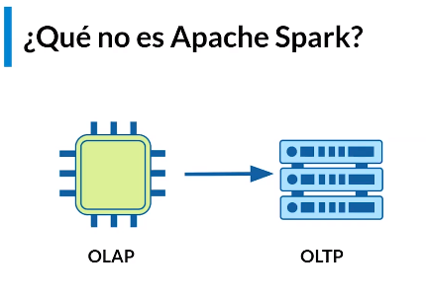

**OLAP:** Base de datos tradicional en tiempo real

Spark debe estar conectado a un Data warehouse para poder aprovechar toda su funcionalidad

#### Hisotoria

- Nace en 2009 en la Universidad Berkeley
- Hereda de Hadoop
- Version3 fue liberada en Junio 2020

#### Spark VS Hadoop

- Spark se enfoca en procesamiento de datos desde la memoria ram.

- Posee naturalmente un modulo para ML, streaming y grafos.

- No depende de un sistema de archivos.

### Clase 3 Introduccion a los RDDs y DataFrames

#### Componentes de Spark

Las dos principales que soporta Spark son los **RDD** y los **DataFrames**.

La diferencia reside en la estructura que poseen.

Los **RDD** son el **componente mínimo con el cual podemos comunicarnos con Spark**, es un lenguaje ensamblador de spark.

#### Caracteristicas de los RDD

- **Principal Abstracción de datos** es la unidad básica, existen desde el inicio hasta la version 3 de Spark.

- **Distribución** Los RDD se distribuyen y particionan a lo largo del cluster de maquinas conectadas.

- **Creación simple** no tienen una estructura formalmente, adoptan la mas intuitiva (listas, tuplas, etc).

- **Inmutabilidad** Posterior a su creación no se pueden modificar, permite persistencia en los datos pero en cierto punto tienes que lanzar un garbage collector para  eliminar los RDDs basura para poder limpiar la memoria

- **Ejecución perezosa**  a menos que se realize una acción.

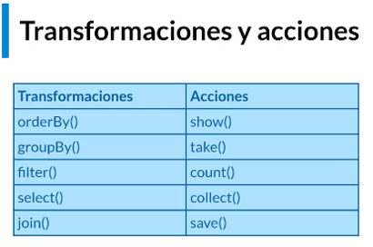

Todas las **transformaciones** las realizamos sin problema, realizando una **Acción** damos vida a lo que estamos creando.

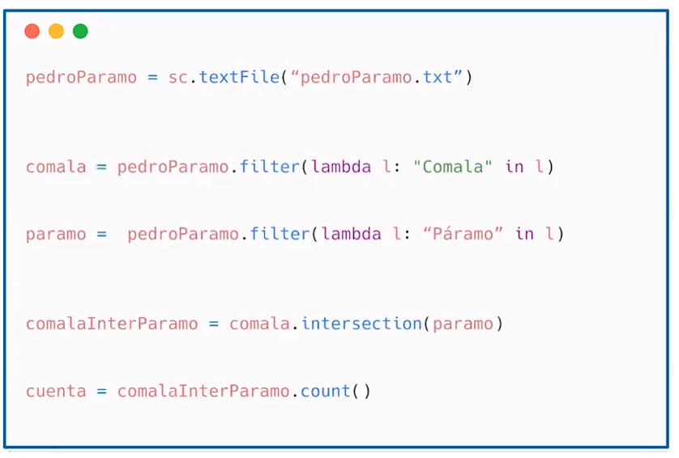

En este ejemplo creamos  dos RDD **comala** y **paramo** sin embargo el archivo pedroParamo.txt podría no existir, sin embargo hasta que yo ejecute el count() (una acción sabremos que hubo un error)

#### Caracteristicas de los DataFrame

- **Formato** a diferencia de un RDD poseen columnas lo cual les otorga tipos de datos.

- **Optimizacion** poseen una mejor implementación, lo cual los hace preferibles (aunque están construidos sobre los RDD).

- **Facilidad de creación** Se pueden crear desde una base de datos externa, archivo o RDD existente.

#### Cuando Usar RDD

-> Cuando te interese controlar el flujo de Spark

-> Si eres usuario de Python, convertir a RDD un conjunto permite mejor control de los datos

-> Estas conectándote a versiones antiguas de Spark.

#### Cuando Usar DataFrames

-> Si poseemos semánticas de datos complicadas (operaciones muy computadas).

-> Vamos a realizar tareas de alto nivel como filtros, mapeos, agregaciones, promedios o sumas.

-> Si vamos a usar sentencias SQL-like

#### Resumen

Los RDD y DataFrames tienen 3 caracteristicas base

- Distribuidos
- Inmutables
- Perezosos
- Estructura (solo DataFrame)

## Modulo 2 Configuracion

### Clase 4 Instalacion del ambiente de trabajo

#### Instalacion de JRE, Python, PIP y Scala

Instalaremos lo siguiente en linux/wsl2

- Agregamos java8 usando open jdk

```bash
sudo ad-apt-repository ppa:openjdk-r/ppa
sudo apt-get update && sudo apt-get upgrade -y
sudo apt-get -y install openjdk-8-jre
```

- Python 3.7 esto porque spark 2.4 no tiene soporte aun para python 3.8

```bash
sudo add-apt-repository ppa:deadsnakes/ppa
sudo apt update
sudo apt install python3.7
```

- Scala

```bash
sudo apt-get -y install scala
```

- Pip3

```bash
sudo apt-get -y install python3-pip
sudo pip3 install py4j
#traduce condigo python a java
```

#### Instalacion de  Apache Spark

En la pagina de Apache Spark <https://spark.apache.org/downloads.html>

Seleccionamos la opción Spark release 2.4.1, con el Pre-built for Apache Hadoop 2.7, y después haces click en Download.

Descarga directo a wsl con curl o de forma habitual con windows

```bash
curl -o spark-2.4.7-bin-hadoop2.7.tgz https://downloads.apache.org/spark/spark-2.4.7/spark-2.4.7-bin-hadoop2.7.tgz
```

Descomprimir el archivo (debes estar en el folder donde se encuentre descargado tu archivo)

```bash
tar -xvf spark-2.4.7-bin-hadoop2.7.tgz

#verificamos
ls
```

Renombramos la carpeta/directorio

```bash
mv spark-2.4.7-bin-hadoop2.7 spark
```

movemos la carpeta a home

```bash
mv spark ~/
```

Borramos el archivo tgz que descargamos

```bash
rm spark-2.4.7-bin-hadoop2.7.tgz
```

#### Instalacion de Anaconda

```bash
# Descargamos
wget https://repo.anaconda.com/archive/Anaconda3-2020.02-Linux-x86_64.sh

# Instalamos
bash Anaconda3-2020.02-Linux-x86_64.sh

# Do you wish the installer to initialize Anaconda3
# by running conda init? [yes|no]
# [no] >>> no
```

#### Instalamos py4j en Anaconda

Para poder hacer uso del instalador de anaconda exportamos la siguiente variable

```bash
# la variable $USER para acceder tu nombre de usuario
export PATH=/home/$USER/anaconda3/bin:$PATH

# Instalamos py4j
conda install py4j
```

### Clase 5 Jupyter vs CLI: ejecucion de Spark desde la linea de comandos

Hecha la instalacion de Spark agregaremos varias variables de entorno en el archivo .bashrc, vamos al final del archivo y agregamos lo siguiente

**Nota:** Si eres estudiante de platzi, y por alguna razón usas zshell  y no la bash (la terminal por defecto sin customizar) deberás incluir la configuracion en el archivo .zshrc y no en el archivo .bashrc.

```bash
sudo nano .bashrc

## Path de Java
export JAVA_HOME="/usr/lib/jvm/java-8-openjdk-amd64"
export PATH=$JAVA_HOME:$PATH

## Spark
export SPARK_HOME='/home/'$USER'/spark'
export PATH=$SPARK_HOME:$PATH

## Python para ser utilizable por Spark
export PYTHONPATH=$SPARK_HOME/python:$PYTHONPATH
export PYSPARK_PYTHON=python3.7

# Guardamos el archivo con ctrl + o
# recargamos el archivo
source .bashrc
```

utilizé la variable de entorno $USER para que no se tenga que ajustar a cada instalacion para aquellas personas que aun no utilizan linux de forma habitual y esto solo agrega el nombre de usuario que tienes en la terminal al path.

Hecho lo anterior vemos los binarios que Spark posee.

```bash
ls ~/spark/bin/
```

En los binarios observamos los siguientes.

- **pyspark**  permite ejecutar código en vivo  como un interprete
- **spark-submit** permite ejecutar un script como cualquier archivo.py

Descargamos el repositorio <https://github.com/terranigmark/curso-apache-spark-platzi>

Utilizamos los archivos data.csv y codeExample.py

```bash
head -n 10 data.csv

# output
State,Color,Count
TX,Red,20
NV,Blue,66
CO,Blue,79
OR,Blue,71
WA,Yellow,93
WY,Blue,16
CA,Yellow,53
WA,Green,60
OR,Green,71
```

```py
import sys

from pyspark.sql import SparkSession
from pyspark.sql.functions import count

if __name__ == "__main__":
    if len(sys.argv) != 2:
        print("Usage: mnmcount <file>", file=sys.stderr)
        sys.exit(-1)

    spark = (SparkSession
        .builder
        .appName("PythonMnMCount")
        .getOrCreate())
    # get the M&M data set file name
    mnm_file = sys.argv[1]
    # read the file into a Spark DataFrame
    mnm_df = (spark.read.format("csv")
        .option("header", "true")
        .option("inferSchema", "true")
        .load(mnm_file))
    mnm_df.show(n=5, truncate=False)
    # aggregate count of all colors and groupBy state and color
    # orderBy descending order
    count_mnm_df = ( mnm_df.select("State", "Color", "Count")
                    .groupBy("State", "Color")
                    .agg(count("Count")
                    .alias("Total"))
                    .orderBy("Total", ascending=False))
    # show all the resulting aggregation for all the dates and colors
    count_mnm_df.show(n=60, truncate=False)
    print("Total Rows = %d" % (count_mnm_df.count()))
    #
    # find the aggregate count for California by filtering
    ca_count_mnm_df = ( mnm_df.select("*")
                       .where(mnm_df.State == 'CA')
                       .groupBy("State", "Color")
                       .agg(count("Count")
                            .alias("Total"))
                       .orderBy("Total", ascending=False) )

    # show the resulting aggregation for California
    ca_count_mnm_df.show(n=10, truncate=False)

```

Instala la dependencia **pyspark**

```bash
conda install pyspark
```

Ejecutamos el código con spark-submit y optemos los resultados

```bash
~/spark/bin/spark-submit codeExample.py data.csv
```

Solucionar el primer warning descarga los binarios de hadoop (version 2.7.3, puedes probar 2.10.0)

<https://www.apache.org/dyn/closer.cgi/hadoop/common/hadoop-2.7.3/hadoop-2.7.3.tar.gz>

Y ejecuta lo siguiente en la terminal

```bash
# descomprimir
tar -xvf hadoop-2.7.3.tar.gz

#Renombramos la carpeta/directorio
mv hadoop-2.7.3.tar.gz hadoop

# movemos la carpeta a home
mv hadoop ~/
```

Agrega las siguientes variables de entorno con en la clase anterior, lo agregue después de las de java y antes de Spark

```bash
export HADOOP_HOME='/home/'$USER'/hadoop'
export HADOOP_COMMON_LIB_NATIVE_DIR=$HADOOP_HOME'/lib/native/libhadoop.so.1.0.0'
```

### Clase 6 Jupyter vs CLI: ejecucion de Spark en Jupyter Notebook

Agregamos variables de entorno para trabajar con jupyter notebook a al archivo .bashrc o .zshrc según sea el caso.

```bash
export PYSPARK_DRIVER_PYTHON="jupyter"
export PYSPARK_DRIVER_PYTHON_OPTS="notebook"
export PATH=/home/spark/anaconda3/bin:$PATH
```

te recomiendo instalar jupyter via pip puntualmente para la version 3.7 de python, la segunda recomendación es utilizar un venv, aunque siempre es util tener jupyter a mano, si lo tienes para python 3.8 es necesario borrar todo rastro de la instalacion.

```bash
python3.7 -m pip install jupyter
```

Ahora podemos llamar a jupyter de forma normal o solo escribiendo pyspark.

Llamamos los siguientes modulos de spark (los mas clásicos) sparkContext y SparkSession

```bash
from pyspark import SparkContext
from pyspark.sql import SparkSession
```

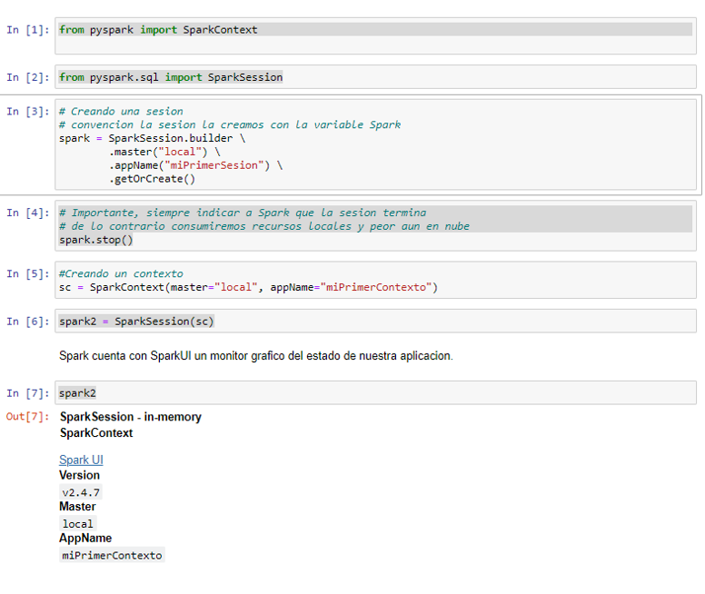

SparkSession engloba los contextos, permite mejores formas de configuracion de Session puedo invocar contextos, podemos pasar contextos a sesiones.

Tenemos la herramienta Spark UI donde podemos administrar RDDs o Dataframes

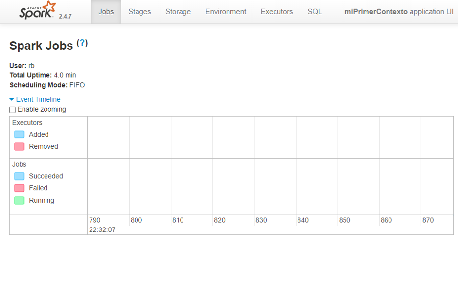

Algo muy importante de Spark es que se ejecuta con un grafo dirigido acíclico

Aquí el código de la clase

```python
from pyspark import SparkContext
from pyspark.sql import SparkSession

# Creando una sesión

# convención la sesión la creamos con la variable Spark
spark = SparkSession.builder \
        .master("local") \
        .appName("miPrimerSesion") \
        .getOrCreate()

# Importante, siempre indicar a Spark que la sesión termina
# de lo contrario consumiremos recursos locales y peor aun en nube
spark.stop()

#Creando un contexto
sc = SparkContext(master="local", appName="miPrimerContexto")

spark2 = SparkSession(sc)

spark2
```

## Modulo 3 Operaciones RDDs

### Clase 7 RDD y DataFrames

Todas las aplicaciones en Spark poseen un manejador central de programa (Driver) y varios ejecutores que se crean a lo largo del clúster, estas son las computadoras que realizarán las tareas en paralelo y finalmente devolverán los valores al driver, la aplicación central.

Para fines de este curso, debido a que se usa un modelo stand-alone, solo se contará con un driver y un ejecutor, ambos alojados en la misma computadora.

#### RDD

Para poder realizar estas tareas, Spark posee desde su versión 1.0 los RDD (**Resilient Distributed Dataset**), los cuales son tolerantes a fallos y pueden ser distribuidos a lo largo de los nodos del clúster.

Los RDD pueden ser creados al cargar datos de manera distribuida, como es desde un HDFS, Cassanda, Hbase o cualquier sistema de datos soportado por Hadoop, pero también por colecciones de datos de Scala o Python, además de poder ser leídos desde archivos en el sistema local.

En visión general, un RDD puede ser visto como un set de datos los cuales soportan solo dos tipos de operaciones:**transformaciones y acciones.**

Las **transformaciones** permiten **crear un nuevo RDD a partir de uno previamente existente**, mientras que las **acciones retornan un valor al driver de la aplicación**. El núcleo de operación del **paradigma de Spark es la ejecución perezosa (Lazy)**, es decir que **las transformaciones solo serán calculadas posterior a una llamada de acción**.

Además, los RDD poseen una familiaridad con el paradigma orientado a objetos, lo cual permite que podamos realizar operaciones de bajo nivel a modo. **Map, filter y reduce son tres de las operaciones más comunes**.

Una de las grandes ventajas que ofrecen los RDD es la **compilación segura**; por su particularidad de ejecución perezosa, se calcula si se generará un error o no antes de ejecutarse, lo cual permite identificar problemas antes de lanzar la aplicación. El pero que podemos encontrar con los RDD es que no son correctamente tratados por el Garbage collector y cuando las lógicas de operación se hacen complejas, su uso puede resultar poco práctico, aquí entran los DataFrames.

#### DataFrames

Esos componentes fueron agregados en la versión 1.3 de Spark y pueden ser invocados con el contexto espacial de Spark SQL. Como indica su nombre, es un módulo especialmente desarrollado para ser ejecutado con instrucciones parecidas al SQL estándar.

De la misma forma, como los RDD, estos pueden ser creados a partir de archivos, tablas tipo Hive, bases de datos externas y RDD o DataFrames existentes.

El primer detalle que salta cuando creamos un DataFrame es que poseen columnas nombradas, lo que a nivel conceptual es como trabajar con un DataFrame de Pandas. Con la excepción que a nivel interno Spark trabaja con Scala, lo cual le asigna a cada **columna el tipo de dato Row**, un tipo especial de objeto sin tipo definido.

Pero no es todo, los DataFrames implementan un sistema llamado **Catalyst**, el cual **es un motor de optimización de planes de ejecución**, parecido al que usan las bases de datos, pero diseñado para la cantidad de datos propia de Spark, aunado a eso, se tiene implementado un **optimizador de memoria y consumo de CPU llamado Tungsten**, el cual determina cómo se convertirán los planes lógicos creados por Catalyst a un plan físico.

Ahora que conoces más sobre RDD y DataFrames es momento de comenzar a utilizarlos en operaciones. Acompáñame a la siguiente clase, empezaremos por ejecutar transformaciones y acciones con los RDD.

### Clase 8 Transformaciones y Acciones

En esta clase vemos como crear un RDD a partir de un archivo csv.

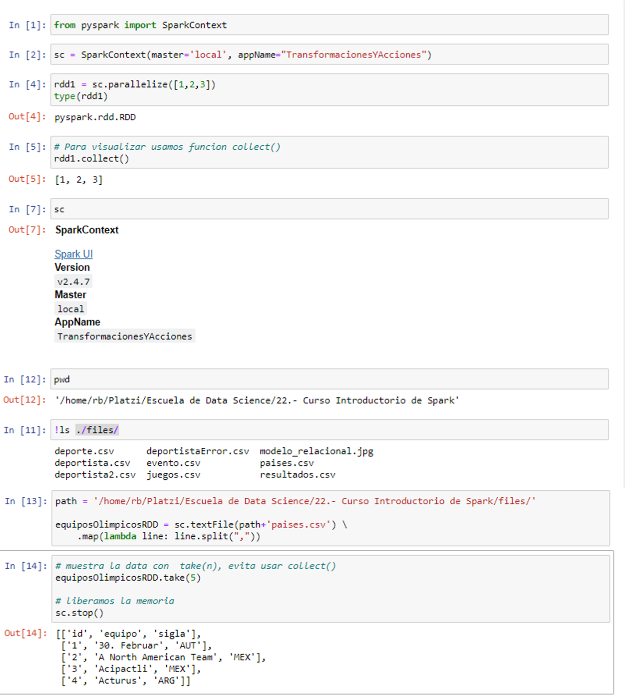

Observamos en spark UI como se representa el grafo de nuestra acción y su metadata.

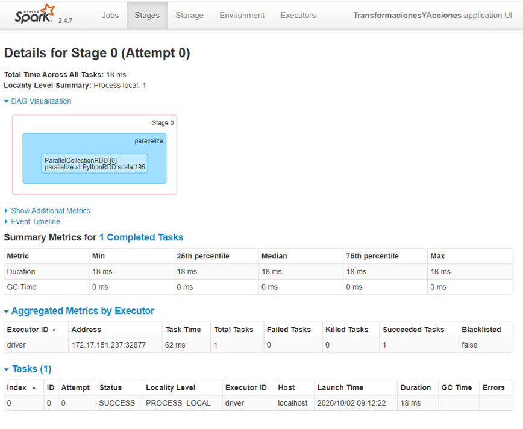

### Clase 9 Acciones de modificacion sobre RDDs

En esta clase interactuamos con el RDD de la clase pasada

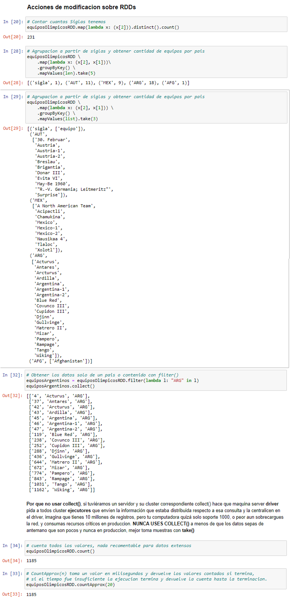

**Por que no usar collect()**, si tuviéramos un servidor y su cluster correspondiente collect() hace que maquina server **driver** pida a todos cluster **ejecutores** que envíen la información que estaba distribuida respecto a esa consulta y la centralicen en el driver, imagina que tienes 10 millones de registros, pero tu computadora quizá solo soporte 1000, o peor aun sobrecargues la red, y consumas recursos críticos en producción. **NUNCA USES COLLECT()** a menos de que los datos sepas de antemano que son pocos y nunca en producción, mejor toma muestras con **take()**

### Clase 10 Acciones de conteo sobre RDDs

En esta clase aprendemos como operar con dos o mas RDDs y obtener valores significativos con ellos.

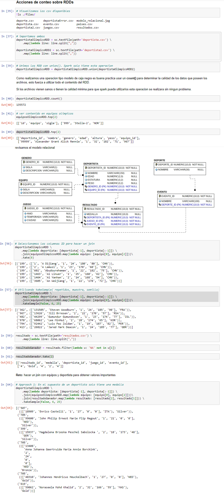

### Clase 11 Solucion reto deportistas

Esta clase muestra la solucion del profesor al reto.

```py
deportistaPaises = deportistaOlimpicoRDD \
    .map(lambda l: [l[-1], l[:-1]]) \
    .join(equiposOlimpicosRDD.map(lambda x: [x[0], x[2]]))

deportistaPaises.join(resultadoGanador).take(6)
```

output

```py
[('74',
  ((['65', 'Patimat Abakarova', '2', '21', '165', '49'], 'AZE'), 'Gold')),
 ('74', ((['129', 'Ruslan Abbasov', '1', '22', '181', '74'], 'AZE'), 'Gold')),
 ('74', ((['130', 'Tural Abbasov', '1', '18', '182', '76'], 'AZE'), 'Gold')),
 ('74', ((['131', 'Tran Abbasova', '2', '33', '159', '53'], 'AZE'), 'Gold')),
 ('74',
  ((['335', 'Abdulqdir Abdullayev', '1', '28', '188', '91'], 'AZE'), 'Gold')),
 ('74',
  ((['336', 'Arif Yadulla Abdullayev', '1', '27', '164', '60'], 'AZE'),
   'Gold'))]
```

### Clase 12 Operaciones Numéricas

En esta clase hacemos el encoding de los valores de las medallas y obtenemos los puntos que tiene cada país.


```py
# el valor de puntaje de paises a lo largo del tiempo
valoresMedallas = {'Gold': 7,
                   'Silver': 5,
                   'Bronze': 4}

paisesMedallas = deportistaPaises.join(resultadoGanador)

paisesMedallas = paisesMedallas \
    .map(lambda x: (x[1][0][-1], valoresMedallas[x[1][1] ] ) )


paisesMedallas.take(5)

from operator import add

conclusion = paisesMedallas.reduceByKey((add)) \
    .sortBy(lambda x:x[1], ascending=False)

conclusion.take(10)
```

## Modulo 4 Data Frames y SQL

### Clase 13 Creación de DataFrames

#### Beneficios DataFrames

- Permite procesar como una tabla de base de datos los DF.
- Poseen estructura y pueden ser creados como ls DF.
- Una optimizacion debido al optimizador de consultas **Catalyst** y el motor de Ejecucion **Tungsten**.

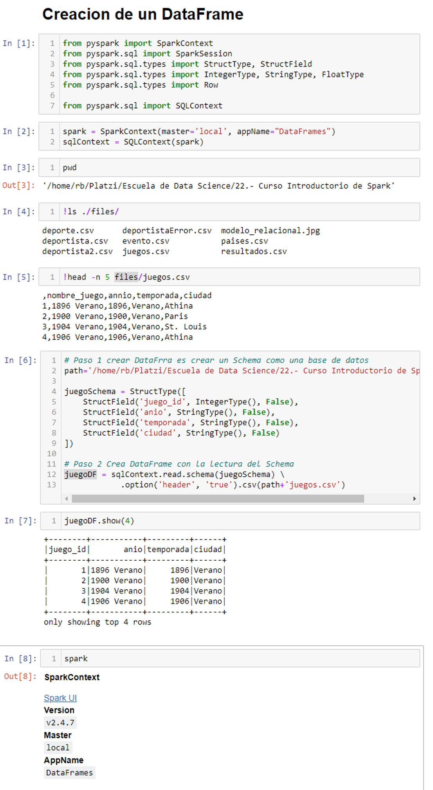

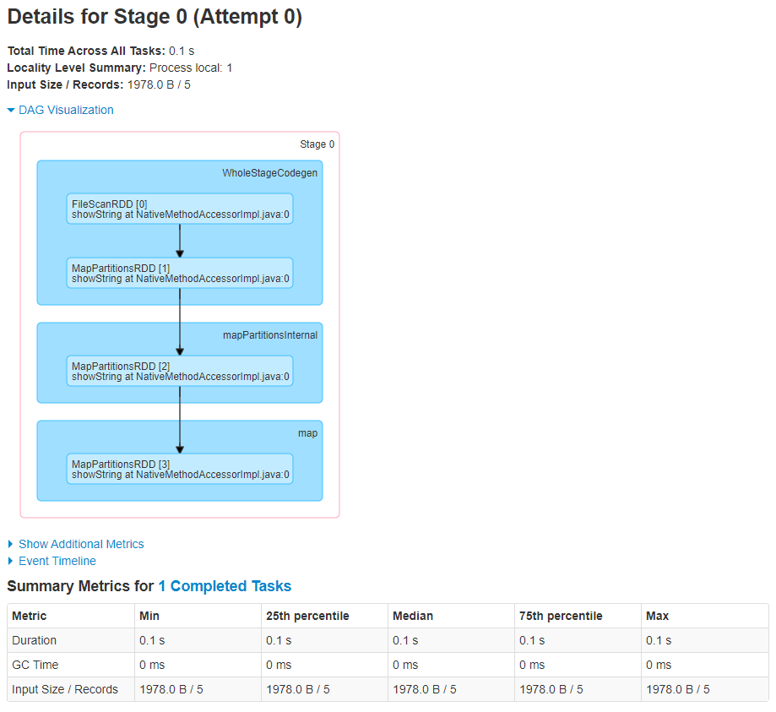

Internamente Spark ya realizo varias operaciones para crear el DataFrame.

### Clase 14 Inferencia de tipos de datos

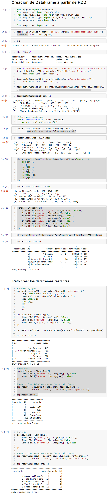

### Clase 15 Operaciones sobre DF

En esta clase aprendemos como obtener el schema de un DataFrame, a renombrar columnas y **select()**.

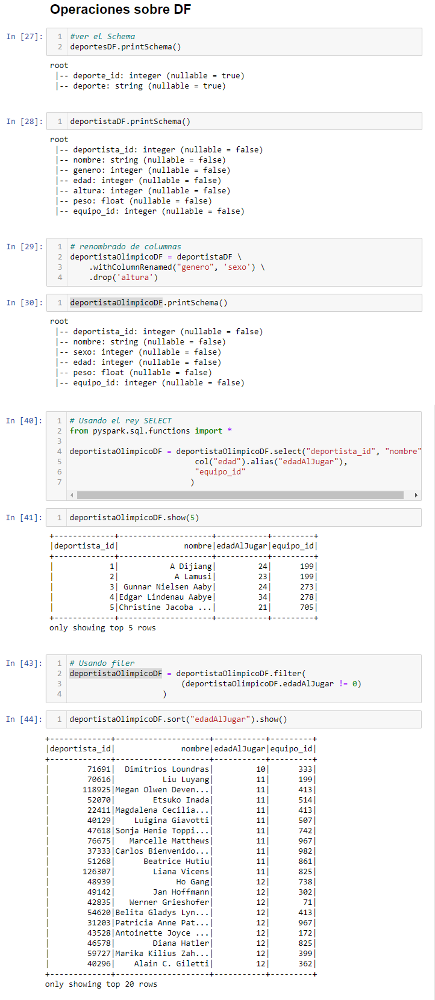

### Clase 16 Agrupaciones y operaciones join sobre DF

Revisaremos los esquemas y realizaremos una serie de joins entre los DataFrames.

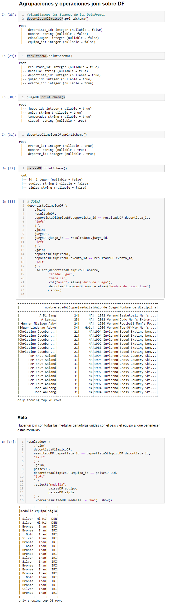

### Clase 17 Solucion reto joins

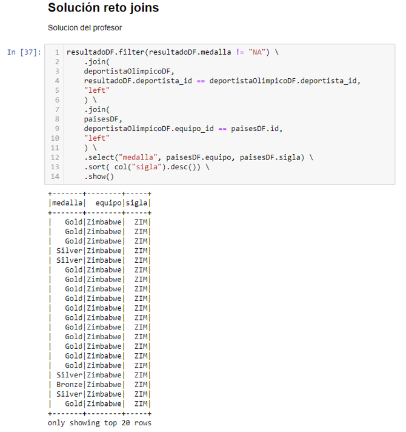

### Clase 18 Funciones de agrupación

En esta clase revisamos cuales son las funciones de agrupación con que cuenta Spark.


### Clase 19 SQL

En esta clase registramos DataFrames como si fueran SQL y veremos las diferencias entre ejecutar SQL como si fuera Spark y la forma nativa.

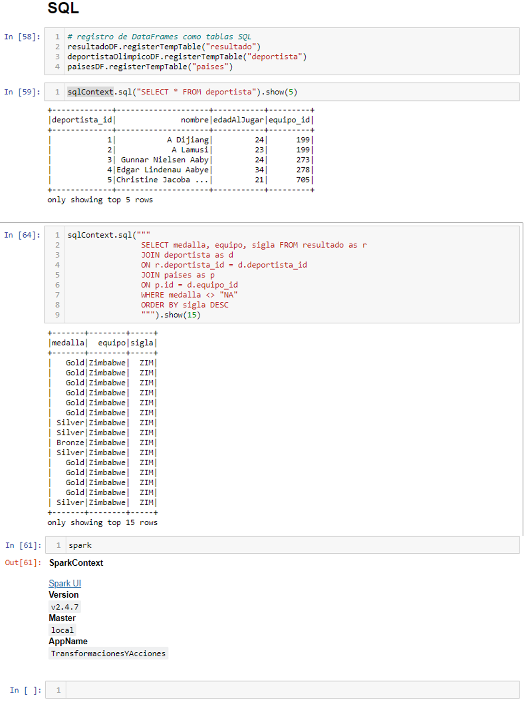

En términos generales el script de SQL es mas rápido que utilizar la sintaxis de Spark, sin embargo el trade-off es que es **mas costoso** computacionalmente, esto lo podemos observar en el gráfico de SparkUI, donde Catalyst nos ayuda.

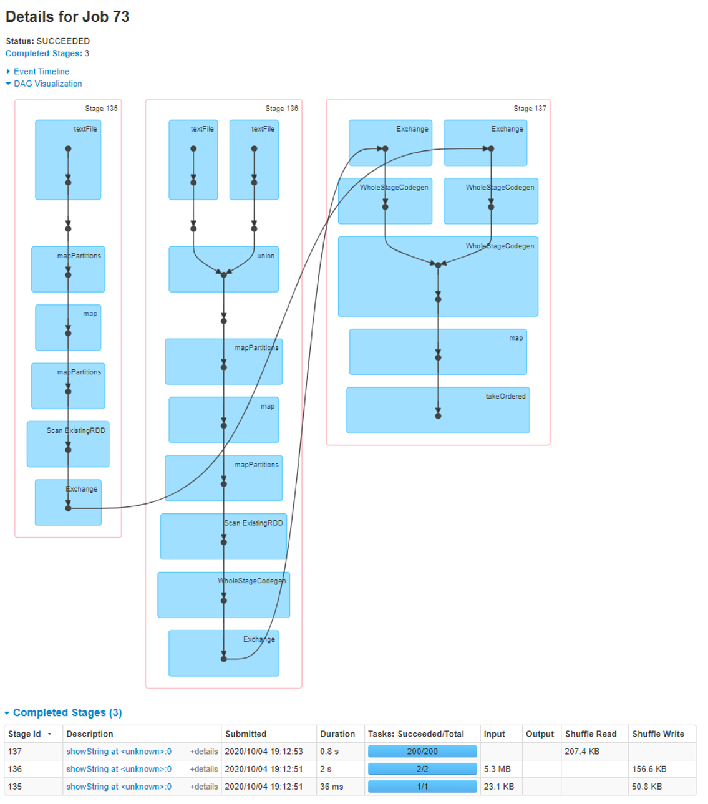

Recomendación, si vas a hacer cruces, joins o funciones de agregacion es mejor usar el poder de SPARK y sus funciones nativas.

### Clase 20 Que es un UDF

as funciones definidas por el usuario o UDF, por sus siglas en inglés, son una funcionalidad agregada en Spark para definir funciones basadas en columnas las cuales permiten extender las capacidades de Spark al momento de transformar el set de datos.

Este tipo de implementaciones son convenientes cuando tenemos un desarrollo extenso donde hemos identificado la periodicidad de tareas repetitivas como suele ser en pasos de limpieza de datos, transformación o renombrado dinámico de columnas.

Por lo anterior es común encontrar en un proyecto de Spark una librería independiente donde existen todas estas funciones agregadas para que los desarrolladores involucrados en el proyecto puedan usarlas a conveniencia.

El uso de UDF no implica que las funciones que podemos crear nativamente con Python, Scala, R o Java no sean útiles. Una UDF tiene el objetivo de ofrecer un estándar interno en el proyecto que nos encontremos realizando. Además, en caso de ser necesario, una UDF puede ser modificada con ayuda de decoradores para que sea más extensible en diversos escenarios a los cuales nos podemos enfrentar.

Otro motivo para usar UDF es que en el módulo de Spark MLlib, la librería nativa de Spark para operaciones de Machine Learning, las UDF juegan un papel vital al momento de hacer transformaciones. Por lo cual tener un uso familiar de estas ampliará considerablemente la curva de aprendizaje de Spark MLlib.

En la siguiente clase crearás e invocarás tus primeras UDF para realizar tareas específicas. ¡Te espero allá!

### Clase 21 UDF

Una de las ventajas de las UDF es registrarlas para que trabajen nativamente y ademas poder usarlas con las consultas de SQL estándar

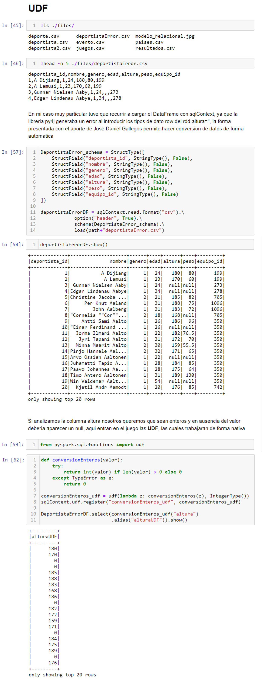

## Modulo 5 Persistencia y particionado

### Clase 22 Particionado

Como se ha descrito en clases pasadas, los RDD son la capa de abstracción primaria para poder interactuar con los datos que viven en nuestro ambiente de Spark. Aunque estos puedan ser enmascarados con un esquema dotándolos de las facultades propias de los DataFrames, la información de fondo sigue operando como RDD.

Por lo tanto, la información, como indica el nombre de los RDD, se maneja de forma distribuida a lo largo del clúster, facilitando las operaciones que se van a ejecutar, ya que segmentos de información pueden encontrarse en diferentes ejecutores reduciendo el tiempo necesario para acceder a la información y poder así realizar los cálculos necesarios.

Cuando un RDD o DataFrame es creado, según las especificaciones que se indiquen a la aplicación de Spark, creará un **esquema de particionado básico**, el cual distribuirá los datos a lo largo del clúster. Siendo así que al momento de ejecutar una acción, esta se ejecutará entre los diversos fragmentos de información que existan para poder así realizar de la forma más rápida las operaciones. Es por eso que un correcto esquema de particionado es clave para poder tener aplicaciones rápidas y precisas que además consuman pocos recursos de red.

Otra de las tareas fundamentales es la **replicación de componentes y sus fragmentos**, ya que al aumentar la disponibilidad de estos podremos asegurar una tolerancia a fallos, mientras más se replique un valor es más probable que no se pierda si existe un fallo de red o energía, además de permitir una disponibilidad casi inmediata del archivo buscado.

La partición y replicación son elementos que deben ser analizados según el tipo de negocio o requerimientos que se tengan en el desarrollo que se encuentre en progreso, por lo cual la cantidad de datos replicados o granularidad de datos existentes en los fragmentos dependerá en función de las reglas de negocio.

En las siguientes clases profundizaremos en estos conceptos y crearemos un particionado simple de datos con ayuda de las funciones **getNumpartitions** y **glom**. ¡Te veo en la siguiente clase!

### Clase 23 Comprendiendo la persistencia y particionado

#### Persistencia

**Problemas al usar un RDD o DF varias veces**:

-> Spark recomputa el componente y sus dependencias cada vez que se ejecuta una acción.

-> Es costoso (especialmente en problemas iterativos).

**Solucion**.

-> Conservar el componente en memoria y/o disco.

-> Métodos **cache()** o **persist()** nos ayudan.

-> En PySpark los datos son almacenados de forma serializada.

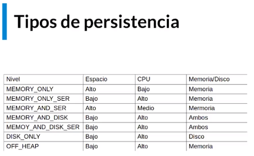

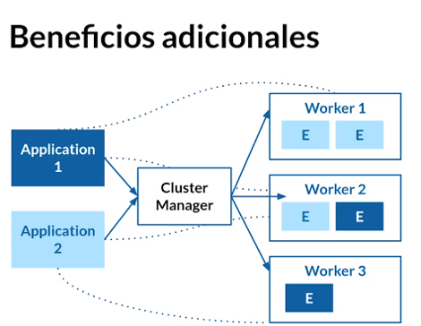

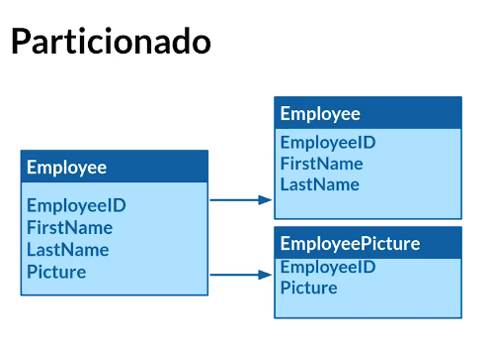

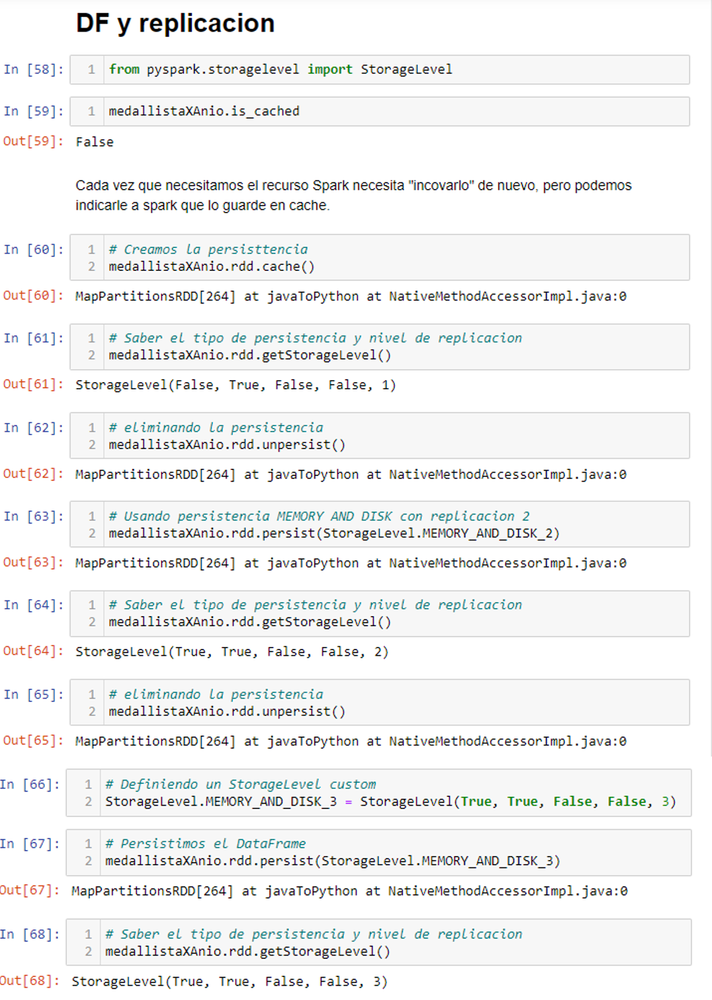

### Clase 24 Particionando datos

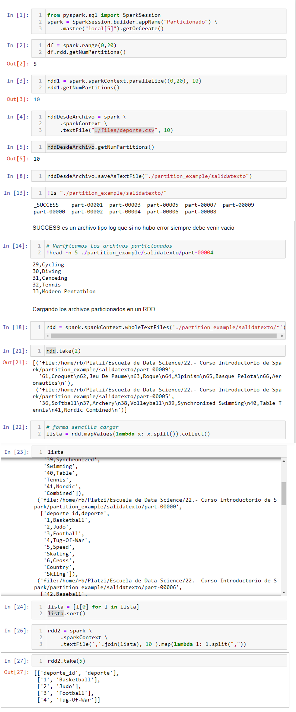